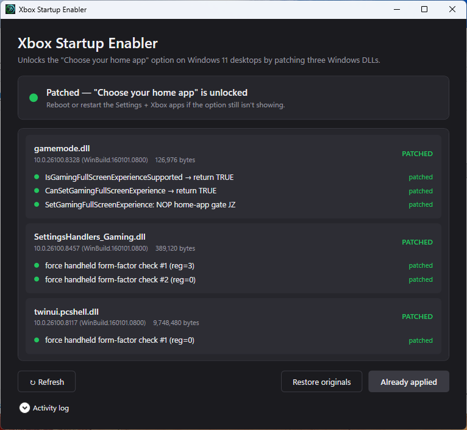

<h1>
  
  Xbox Startup Enabler
</h1>



Windows 11 ships a "Choose your home app" option that boots straight into the Xbox Mode instead of the regular desktop shell. It's the same mode that ROG Ally, Legion Go, MSI Claw, and the rest of the handheld gaming PCs use. On a normal desktop the toggle doesn't show up at all, because Windows gates the feature on the device form factor.

The well-known workaround is to spoof the form factor through the registry, but that lies to *every* component on the system, not just the home-app feature, this includes power profiles, thermal limits, sensor stack... **Using the form-factor workaround may unnecessarily throttle the performance on desktop or incur unintended consequences.**

To this effect, this is a smaller patcher that flips only the three form-factor checks that gate xbox mode on startup, but leaves Windows thinking you're still on a desktop.

Tested on Windows 11 Pro 26200.8457. Earlier or later builds may have shifted the byte layout enough that the patcher refuses to apply. If so, it will say so and not write anything.

## Build

Needs the .NET 8 SDK.

```
dotnet build XboxStartupEnabler.sln -c Release
```

For release artifacts (framework-dependent + self-contained single-file builds, dropped into `release\`):

```
.\scripts\publish.ps1
```

## Use

Run `XboxStartupEnabler.exe`, which requires admin access (The patched binaries are stored in System32 aand require administrator permission). The window has one card per DLL, with each patch site colored green when it's currently applied. Click **Apply patches**, sign out (or reboot), and the next sign-in should land in Xbox Mode.

A CLI mode is there for scripting:

```
XboxStartupEnabler.exe status
XboxStartupEnabler.exe verify          # status + hex dump of every site
XboxStartupEnabler.exe apply --yes
XboxStartupEnabler.exe restore
XboxStartupEnabler.exe apply --dir .\sandbox --yes   # dry-run on copies
```

## What it patches

Six small byte edits across three system DLLs:

- `gamemode.dll`: gaming-experience Windows API used by the Xbox app and Settings.
- `SettingsHandlers_Gaming.dll`: backs the Settings - Gaming page.
- `twinui.pcshell.dll`: shell library that decides whether to launch the home app at sign-in.

## Caveats

- Cumulative Windows Updates replace these DLLs with fresh originals. The option will silently disappear next time Microsoft ships an update to one of them. Run **Apply** again. If the bytes have drifted enough that the patcher can't recognize either the original or patched layout, it refuses to write, and the patterns in `BuildGameModePatches` / `BuildHandheldCheckPatches` need to be re-derived from the new build.
- `sfc /scannow` undoes all of this from the component store.

## Disclaimer

By using this tool, you acknowledge and agree to the following:

- **System Modification.** This tool performs deep modifications to Windows and may cause instability, crashes, data loss, or require OS reinstallation.
- **Use at Your Own Risk.** You are fully responsible for any consequences. The developer provides no warranty, support, or liability for any damages.
- **No Guarantees.** The tool is provided as is with no guarantee of stability, compatibility, or functionality. It may not work correctly on your specific configuration.
- **Backup Required.** Always back up your important data and create a system restore point before use.
- **Unofficial Tool.** This project is not affiliated with, endorsed by, or supported by Microsoft or Xbox.

